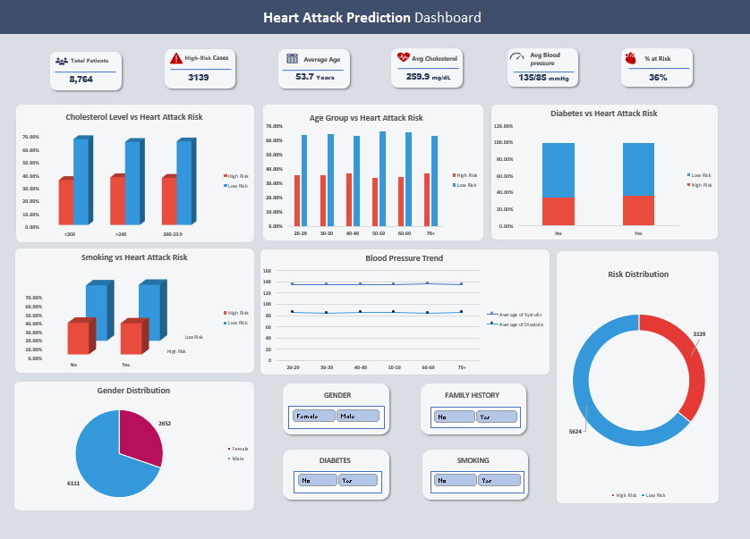

# Heart Attack Prediction Dashboard

## 📌 Project Overview

The Heart Attack Prediction Dashboard is an interactive Excel-based analytics dashboard designed to visualize and analyze factors contributing to heart attack risk. The dashboard helps users understand trends and relationships between various health parameters such as cholesterol level, blood pressure, smoking habits, diabetes, age group, and family history.

This project demonstrates the use of Excel for healthcare data analysis, visualization, and dashboard development using Pivot Tables, Pivot Charts, KPIs, and Slicers.

---

## 🎯 Objectives

* Analyze heart attack risk using healthcare data
* Visualize important medical indicators
* Create an interactive dashboard for better decision-making
* Demonstrate data analysis and dashboarding skills using Excel

---

# 📊 Dashboard Features

### KPI Cards

The dashboard includes important KPI indicators such as:

* Total Patients
* High-Risk Cases
* Average Age
* Average Cholesterol
* Average Blood Pressure
* Percentage at Risk

---

### Interactive Charts

The dashboard contains the following visualizations:

1. Cholesterol Level vs Heart Attack Risk
2. Age Group vs Heart Attack Risk
3. Diabetes vs Heart Attack Risk
4. Smoking vs Heart Attack Risk
5. Blood Pressure Trend Analysis
6. Risk Distribution Donut Chart
7. Gender Distribution Pie Chart

---

### Interactive Filters (Slicers)

Users can filter dashboard data dynamically using:

* Gender
* Family History
* Diabetes
* Smoking

---

# 🛠️ Tools & Technologies Used

* Microsoft Excel
* Pivot Tables
* Pivot Charts
* Slicers
* Conditional Formatting
* Data Cleaning & Transformation
* KPI Cards
* Dashboard Design Techniques

---

# 📂 Dataset Information

The dataset contains healthcare-related information including:

* Age
* Gender
* Cholesterol Level
* Blood Pressure
* Smoking Habit
* Diabetes Status
* Family History
* Heart Attack Risk

---

# 📈 Key Insights

* Higher cholesterol levels show increased heart attack risk.
* Smoking and diabetes are major contributing factors.
* Certain age groups show higher risk percentages.
* Blood pressure trends help identify risk patterns.
* Male patients represent a larger portion of the dataset.

---

# 🚀 How to Use

1. Download the Excel dashboard file.
2. Open the file in Microsoft Excel.
3. Use slicers to filter data interactively.
4. Analyze charts and KPIs for insights.

---

# 📸 Dashboard Preview

---

# 💡 Skills Demonstrated

* Data Analysis
* Data Visualization
* Dashboard Designing
* Excel Automation
* Healthcare Analytics
* Interactive Reporting
* Business Intelligence Concepts

---

# 🔮 Future Improvements

* Add Machine Learning prediction model
* Integrate Power BI version
* Add real-time healthcare dataset support
* Improve dashboard responsiveness and UI design

---

# 👩‍💻 Author

Vaishnavi Dhumal

---

# ⭐ If you like this project

Give this repository a star and feel free to fork it for learning purposes.
